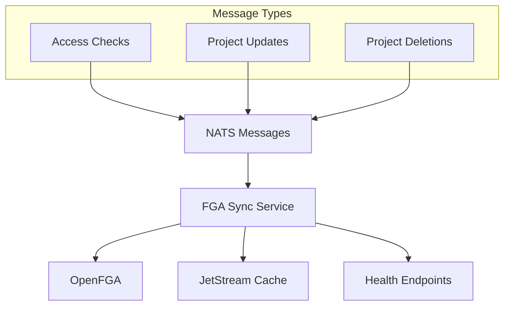

# LFX v2 FGA Sync Service


A high-performance microservice that synchronizes authorization data between NATS messaging and OpenFGA (Fine-Grained Authorization), providing cached relationship checks and real-time access control updates for the LFX Platform v2.

## 🚀 Features

- **Real-time Authorization Sync**: Synchronizes project access permissions between NATS and OpenFGA
- **High-Performance Caching**: JetStream-based caching with automatic invalidation for sub-millisecond response times
- **Batch Operations**: Efficient bulk relationship checking and updates
- **Health Monitoring**: Kubernetes-ready health checks and observability
- **Security First**: Comprehensive security scanning and best practices

## 📋 Architecture



### Components

- **Access Check Handler**: Processes authorization queries with intelligent caching
- **Project Update Handler**: Manages project permission synchronization
- **Project Delete Handler**: Handles cleanup of project-related permissions
- **Cache Layer**: JetStream KeyValue store for high-performance relationship caching

## 🛠️ Quick Start

### Prerequisites

- Go 1.23 or later
- NATS Server with JetStream enabled
- OpenFGA server
- Docker (optional)

### Local Development

1. **Clone the repository**:

   ```bash
   git clone https://github.com/linuxfoundation/lfx-v2-fga-sync.git
   cd lfx-v2-fga-sync
   ```

2. **Install dependencies**:

   ```bash
   make deps
   ```

3. **Set up OpenFGA store and authorization model**:

   ```bash
   FGA_API=http://openfga.openfga.svc.cluster.local:8080/store

   # Create OpenFGA store
   curl -X POST $FGA_API \
     -H "Content-Type: application/json" \
     -d '{"name": "lfx_core"}'
   
   STORE_ID=$(curl -s "${FGA_API}/stores" | jq -r '.stores[] | select(.name="lfx_core") | .id')
   
   # Convert .fga model to JSON format (choose one method):
   
   # Method 1: Using OpenFGA CLI (requires installation)
   go install github.com/openfga/cli/cmd/fga@latest
   fga model transform --file lfx-access-model.fga > lfx-access-model.fga.json
   
   # Method 2: Using Docker (no installation required)
   docker run --rm -v ./lfx-access-model.fga:/lfx-access-model.fga openfga/cli model transform --file lfx-access-model.fga >lfx-access-model.fga.json
   
   # Upload authorization model
   curl -X POST http://openfga.openfga.svc.cluster.local:8080/stores/{STORE_ID}/authorization-models \
     -H "Content-Type: application/json" \
     -d @lfx-access-model.fga.json
   
   # Note the authorization_model_id from the response, e.g., "01JZNYHPGTB034VY61QCQAXJZ7"
   ```

   Alternatively, using the OpenFGA CLI:

   ```bash
   # Install OpenFGA CLI
   go install github.com/openfga/cli/cmd/fga@latest
   
   # Create store and model
   fga store create --name "lfx-fga-sync" --api-url http://openfga.openfga.svc.cluster.local:8080
   fga model write --file lfx-access-model.fga --store-id {STORE_ID}
   ```

4. **Set environment variables**:

   ```bash
   export NATS_URL="nats://lfx-platform-nats.lfx.svc.cluster.local:4222"
   export FGA_API_URL="http://openfga.openfga.svc.cluster.local:8080"
   export FGA_STORE_ID="01JZNYAVGM6F9N8CNK0MCPAHMT"  # Use your actual store ID
   export FGA_MODEL_ID="01JZNYHPGTB034VY61QCQAXJZ7"   # Use your actual model ID
   export CACHE_BUCKET="fga-sync-cache"
   export LFX_ENVIRONMENT="dev"
   ```

5. **Create the NATS KeyValue cache bucket**:

   ```bash
   # Using NATS CLI (if available)
   nats kv add fga-sync-cache

   # Or using kubectl if running in Kubernetes
   kubectl exec -n lfx deploy/nats-box -- nats kv add fga-sync-cache
   ```

5. **Run the service**:

   ```bash
   make run
   ```

### Docker Deployment

```bash
# Build the image
make docker-build

# Run with docker-compose
docker run -d \
  -e NATS_URL=nats://nats:4222 \
  -e FGA_API_URL=http://openfga:8080 \
  -e FGA_STORE_ID=01JZNYAVGM6F9N8CNK0MCPAHMT \
  -e FGA_MODEL_ID=01JZNYHPGTB034VY61QCQAXJZ7 \
  -e CACHE_BUCKET=fga-sync-cache \
  -e LFX_ENVIRONMENT=prod \
  -p 8080:8080 \
  linuxfoundation/lfx-v2-fga-sync:latest
```

### Kubernetes Deployment

```bash
# Deploy using Helm
helm install fga-sync ./charts/lfx-v2-fga-sync \
  --set nats.url=nats://lfx-platform-nats.lfx.svc.cluster.local:4222 \
  --set fga.apiUrl=http://openfga.lfx.svc.cluster.local:8080 \
  --set fga.storeId=01JZNYAVGM6F9N8CNK0MCPAHMT \
  --set fga.modelId=01JZNYHPGTB034VY61QCQAXJZ7
```

## 🔧 Configuration

### Environment Variables

| Variable | Description | Default | Required |
|----------|-------------|---------|----------|
| `NATS_URL` | NATS server connection URL | `nats://nats:4222` | Yes |
| `FGA_API_URL` | OpenFGA API endpoint | - | Yes |
| `FGA_STORE_ID` | OpenFGA store ID | - | Yes |
| `FGA_MODEL_ID` | OpenFGA authorization model ID | - | Yes |
| `CACHE_BUCKET` | JetStream KeyValue bucket name | `fga-sync-cache` | No |
| `LFX_ENVIRONMENT` | Environment prefix for NATS subjects | `dev` | No |
| `PORT` | HTTP server port | `8080` | No |
| `DEBUG` | Enable debug logging | `false` | No |

### NATS Subjects

The service subscribes to these NATS subjects (prefixed with `LFX_ENVIRONMENT`):

- `{env}.lfx.access_check.request` - Access permission checks
- `{env}.lfx.update_access.project` - Project permission updates  
- `{env}.lfx.delete_all_access.project` - Project deletion cleanup

## 📊 API Reference

### Health Endpoints

#### Liveness Probe

```http
GET /livez
```

Returns `200 OK` if the service is running.

#### Readiness Probe  

```http
GET /readyz
```

Returns `200 OK` if the service is ready to handle requests (NATS connected).

### Message Formats

#### Access Check Request

```
project:123#admin@user:456
project:789#viewer@user:456
```

#### Project Update Message

```json
{
  "uid": "project-123",
  "public": true,
  "parent_uid": "parent-project-456", 
  "writers": ["user1", "user2"],
  "auditors": ["auditor1"]
}
```

#### Project Delete Message

```
project-123
```

## 🧪 Development

### Running Tests

```bash
# Run all tests
make test

# Run tests with coverage
make test-coverage

# Run specific test
go test -v ./... -run TestAccessCheckHandler
```

### Code Quality

```bash
# Format code
make fmt

# Run linter
make lint

# Run security checks
make vet

# Run all quality checks
make check
```

### Building

```bash
# Build for current platform
make build

# Build for multiple platforms
make build-all

# Build development version (with debug symbols)
make dev
```

## 📈 Performance

- **Throughput**: 10,000+ relationship checks per second
- **Latency**: Sub-millisecond response times with cache hits
- **Cache Hit Rate**: >95% for typical workloads
- **Memory Usage**: ~64MB baseline, scales with cache size

### Caching Strategy

1. **Cache Key Format**: `rel.{base32-encoded-relation}`
2. **Cache Invalidation**: Timestamp-based with automatic cleanup
3. **Cache TTL**: Configurable via JetStream bucket settings
4. **Fallback**: Direct OpenFGA queries on cache miss

## 🛡️ Security

- **Principle of Least Privilege**: Runs as non-root user (nobody)
- **Read-only Filesystem**: Container uses read-only root filesystem
- **Security Scanning**: Automated vulnerability scanning with Trivy and Gosec
- **Secret Management**: No secrets stored in code or environment variables

## 🔍 Monitoring

### Metrics

The service exposes metrics via expvar at `/debug/vars`:

- `cache_hits` - Number of successful cache lookups
- `cache_stale_hits` - Number of stale cache entries used
- `cache_misses` - Number of cache misses requiring OpenFGA queries

### Logging

Structured JSON logging with configurable levels:

```bash
# Enable debug logging
export DEBUG=true

# View logs in development
make run 2>&1 | jq '.'
```

## 🚢 Deployment

### Helm Chart

The repository includes a production-ready Helm chart:

```yaml
# values.yaml
application:
  replicas: 3
  resources:
    requests:
      memory: "64Mi"
      cpu: "100m"
    limits:
      memory: "128Mi" 
      cpu: "500m"

nats:
  url: "nats://lfx-platform-nats.lfx.svc.cluster.local:4222"

fga:
  apiUrl: "http://openfga.lfx.svc.cluster.local:8080"
```

### Production Considerations

- **Horizontal Scaling**: Multiple replicas supported with NATS queue groups
- **Resource Limits**: Configure appropriate CPU/memory limits
- **Network Policies**: Restrict traffic to NATS and OpenFGA only
- **Monitoring**: Set up alerts for cache hit rates and error rates

## 🤝 Contributing

1. Fork the repository
2. Create a feature branch (`git checkout -b feature/amazing-feature`)
3. Make your changes
4. Run tests (`make test`)
5. Run quality checks (`make check`)
6. Commit your changes (`git commit -m 'Add amazing feature'`)
7. Push to the branch (`git push origin feature/amazing-feature`)
8. Open a Pull Request

### Code Standards

- Follow Go best practices and idioms
- Maintain test coverage above 80%
- Use structured logging with appropriate levels
- Include comprehensive error handling
- Update documentation for new features

## 📄 License

This project is licensed under the MIT License - see the [LICENSE](LICENSE) file for details.

## 🆘 Support

- **Issues**: [GitHub Issues](https://github.com/linuxfoundation/lfx-v2-fga-sync/issues)
- **Discussions**: [GitHub Discussions](https://github.com/linuxfoundation/lfx-v2-fga-sync/discussions)
- **Security**: Report security issues via [SECURITY.md](SECURITY.md)

## 🙏 Acknowledgments

- [OpenFGA](https://openfga.dev/) - Authorization framework
- [NATS](https://nats.io/) - High-performance messaging system
- [The Linux Foundation](https://www.linuxfoundation.org/) - Project stewardship
